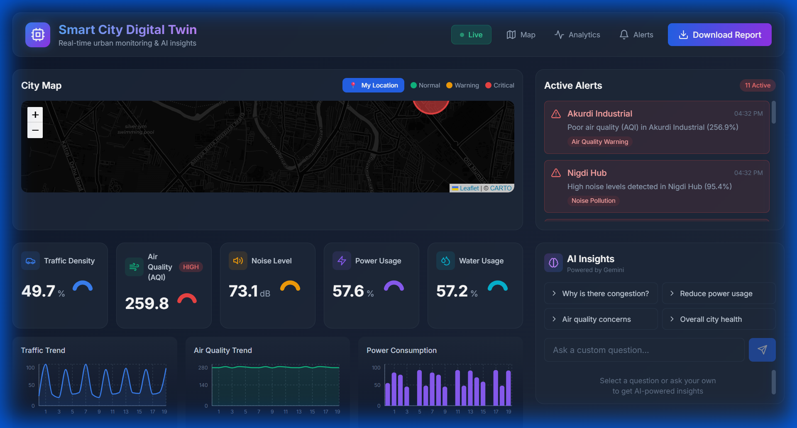

# 🏙️ Smart City Digital Twin

[](https://opensource.org/licenses/MIT)
[](https://python.org)
[](https://reactjs.org)
[](https://flask.palletsprojects.com)

> A production-ready web application simulating a smart city with **real-time IoT sensor data**, **interactive visualizations**, **AI-powered insights via Gemini**, and **PDF sustainability reports**.



## ✨ Features

| Feature | Description |
|---------|-------------|
| 🗺️ **Interactive Map** | Leaflet-based map with color-coded zone status and real-time sensor popups |
| 📊 **Live Sensor Data** | Real-time gauges & charts for traffic, AQI, noise, power, water |
| 🌍 **Real AQI Integration** | Live air quality data from OpenWeatherMap API |
| 📍 **Geolocation** | GPS + IP-based location detection with click-to-set |
| 🚨 **Smart Alerts** | Automatic alerts when sensor thresholds are exceeded |
| 🤖 **AI Insights** | Gemini API integration for intelligent city analysis |
| 📄 **PDF Reports** | One-click sustainability report generation |
| 🌡️ **Weather Data** | Real-time temperature, humidity, and conditions |

## 🛠️ Tech Stack

| Layer | Technology |
|-------|------------|
| **Backend** | Python, Flask, SQLAlchemy |
| **Frontend** | React 18, Tailwind CSS |
| **Database** | SQLite (embedded) |
| **Visualizations** | Recharts, Leaflet.js |
| **AI** | Google Gemini API |
| **Live Data** | OpenWeatherMap API |
| **PDF Generation** | ReportLab |

## 📁 Project Structure

```
Smart-City-Digital-Twin/
├── backend/
│   ├── app.py              # Flask main application
│   ├── config.py           # API keys & configuration
│   ├── models.py           # SQLite database models
│   ├── simulation.py       # IoT sensor data generator
│   ├── live_data.py        # OpenWeatherMap API integration
│   ├── report_generator.py # PDF report generation
│   └── requirements.txt    # Python dependencies
├── frontend/
│   ├── src/
│   │   ├── components/
│   │   │   ├── CityMap.jsx       # Interactive Leaflet map
│   │   │   ├── SensorCharts.jsx  # Recharts visualizations
│   │   │   ├── AlertsPanel.jsx   # Real-time alerts
│   │   │   ├── AIInsights.jsx    # Gemini AI sidebar
│   │   │   └── Header.jsx        # App header
│   │   ├── App.jsx               # Main React app
│   │   └── index.css             # Tailwind styles
│   ├── package.json
│   └── tailwind.config.js
├── screenshots/
├── LICENSE
└── README.md
```

## 🚀 Quick Start

### Prerequisites
- Python 3.8+
- Node.js 16+
- npm or yarn

### 1. Clone the Repository

```bash
git clone https://github.com/DevWizard-Vandan/Smart-City-Digital-Twin.git
cd Smart-City-Digital-Twin
```

### 2. Setup Backend

```bash
cd backend

# Create virtual environment (recommended)
python -m venv venv
venv\Scripts\activate  # Windows
# source venv/bin/activate  # Mac/Linux

# Install dependencies
pip install -r requirements.txt

# Start the server
python app.py
```

Backend runs at: `http://localhost:5000`

### 3. Setup Frontend

```bash
cd frontend

# Install dependencies
npm install

# Start the development server
npm start
```

Frontend runs at: `http://localhost:3000`

## ⚙️ Configuration

### API Keys (Optional but Recommended)

Set environment variables before running the backend:

**Windows (PowerShell):**
```powershell
$env:GEMINI_API_KEY = "your-gemini-api-key"
$env:OPENWEATHER_API_KEY = "your-openweathermap-api-key"
python app.py
```

**Linux/Mac:**
```bash
export GEMINI_API_KEY="your-gemini-api-key"
export OPENWEATHER_API_KEY="your-openweathermap-api-key"
python app.py
```

Or copy `.env.example` to `.env` and fill in your keys.

| API | Get Free Key |
|-----|--------------|
| Gemini | https://aistudio.google.com/ |
| OpenWeatherMap | https://openweathermap.org/api |

> **Note:** The app works without API keys - AI features will show placeholders and AQI uses simulated data.

## 📡 API Endpoints

| Endpoint | Method | Description |
|----------|--------|-------------|
| `/api/sensors` | GET | Current sensor readings for all zones |
| `/api/sensors/history` | GET | Historical sensor data |
| `/api/alerts` | GET | Active alerts list |
| `/api/zones` | GET | City zone configurations |
| `/api/live?lat=&lng=` | GET | Live AQI + weather for any location |
| `/api/ai/analyze` | POST | Send question to Gemini AI |
| `/api/report/generate` | POST | Generate PDF sustainability report |
| `/api/snapshot` | GET | Complete city data snapshot |

## 🏗️ City Zones (Pimpri Chinchwad, Pune)

| Zone | Name | Profile |
|------|------|---------|
| Zone A | Hinjewadi IT Park | High tech activity, moderate traffic |
| Zone B | PCMC Industrial | Industrial area, higher AQI |
| Zone C | Wakad Residential | Residential, low noise |
| Zone D | Aundh Commercial | Commercial hub |
| Zone E | Nigdi Hub | Mixed use area |
| Zone F | Akurdi Industrial | Industrial zone |

## 🎮 Usage

1. **View Map** - Click zones to see detailed sensor readings
2. **My Location** - Click 📍 to detect your location (GPS or IP-based)
3. **Real-time Data** - All metrics update every 3 seconds
4. **AI Analysis** - Ask questions in the AI Insights panel
5. **Download Report** - Generate PDF sustainability report

## 🤝 Contributing

Contributions are welcome! Please feel free to submit a Pull Request.

## 📄 License

This project is licensed under the MIT License - see the [LICENSE](LICENSE) file for details.

## 🙏 Acknowledgments

- [OpenWeatherMap](https://openweathermap.org/) for real-time AQI data
- [Google Gemini](https://ai.google.dev/) for AI-powered insights
- [Leaflet](https://leafletjs.com/) for interactive maps
- [Recharts](https://recharts.org/) for beautiful charts

---

**Built with ❤️ by [DevWizard-Vandan](https://github.com/DevWizard-Vandan)**

*Perfect for learning, portfolio showcase, and impressing recruiters!* 🎯
